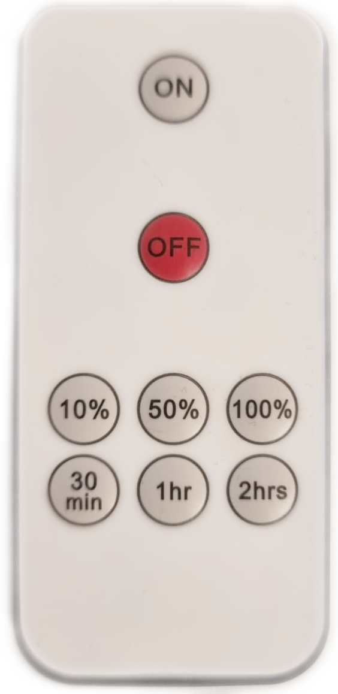
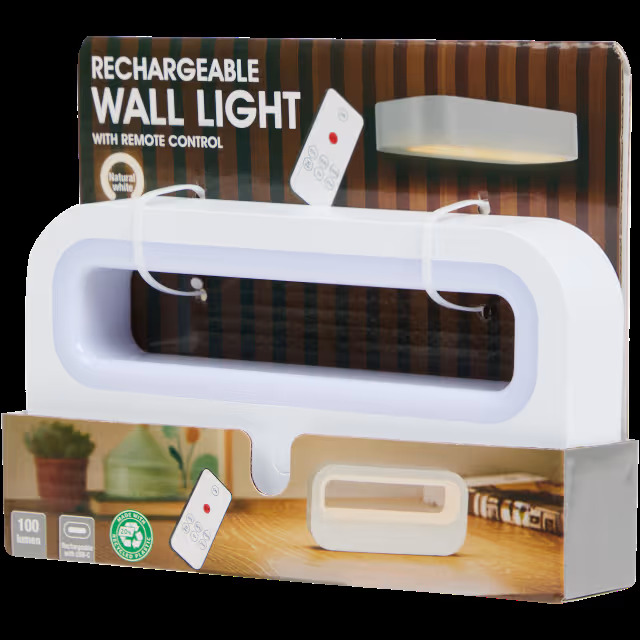

## DecodeWallLightRC
Decodes Rechargeable Wall Light IR Remote  codes for each button:

|   |   |   |
|---|---|---|
| n/a| **ON**  [157]| n/a|
| n/a|n/a|n/a|
| n/a| **OFF** [&nbsp;&nbsp;21]| n/a|
| n/a| n/a| n/a|
|    **10%** [&nbsp;&nbsp;12] | **50%** [&nbsp;&nbsp;24]| **100%** [&nbsp;&nbsp;133] |
| **30min** [&nbsp;&nbsp;8]|  **1h**  [199]| **2h**  [165]|
|   n/a   | n/a|   n/a    | 
 
 

Sourced from [Action](https://www.action.com/nl-nl/p/3216834/oplaadbare-wandlamp/) 

IR button codes decoded with [ShowRawIRCode](../ShowRawIRCode)
 
 
 

 
 
 
## Gebruiken als extensie

Deze repository kan worden toegevoegd als **extensie** in MakeCode.

* open [https://makecode.microbit.org/](https://makecode.microbit.org/)
* klik op **Nieuw project**
* klik op **Extensies** onder het tandwielmenu
* zoeken naar **https://github.com/roboracemsw/DecodeWallLightRC** en importeren

## Dit project bewerken

Om deze repository te bewerken in MakeCode.

* open [https://makecode.microbit.org/](https://makecode.microbit.org/)
* klik op **Importeren** en klik vervolgens op **Importeer URL**
* plak **https://github.com/roboracemsw/DecodeWallLightRC** en klik op importeren

#### Metadata (gebruikt voor zoeken, rendering)

* for PXT/microbit

> Open deze pagina op [https://roboracemsw.github.io/decodewalllightrc/](https://roboracemsw.github.io/decodewalllightrc/)

## Gebruiken als extensie

Deze repository kan worden toegevoegd als **extensie** in MakeCode.

* open [https://makecode.microbit.org/](https://makecode.microbit.org/)
* klik op **Nieuw project**
* klik op **Extensies** onder het tandwielmenu
* zoeken naar **https://github.com/roboracemsw/decodewalllightrc** en importeren

## Dit project bewerken

Om deze repository te bewerken in MakeCode.

* open [https://makecode.microbit.org/](https://makecode.microbit.org/)
* klik op **Importeren** en klik vervolgens op **Importeer URL**
* plak **https://github.com/roboracemsw/decodewalllightrc** en klik op importeren

#### Metadata (gebruikt voor zoeken, rendering)

* for PXT/microbit

